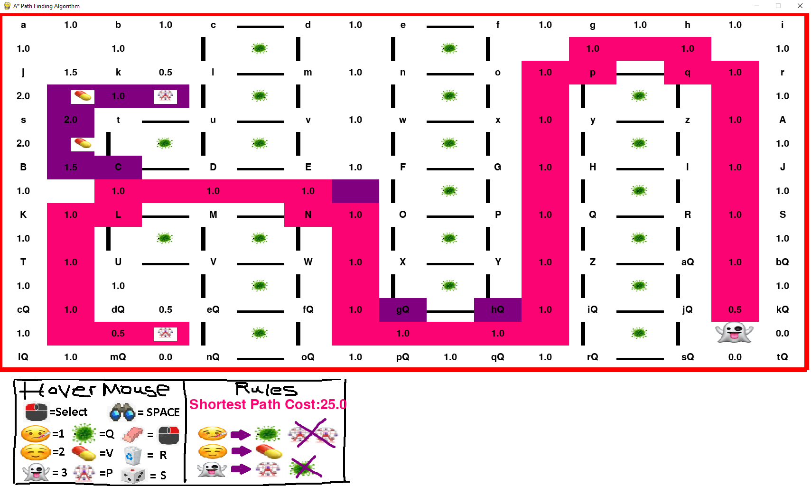
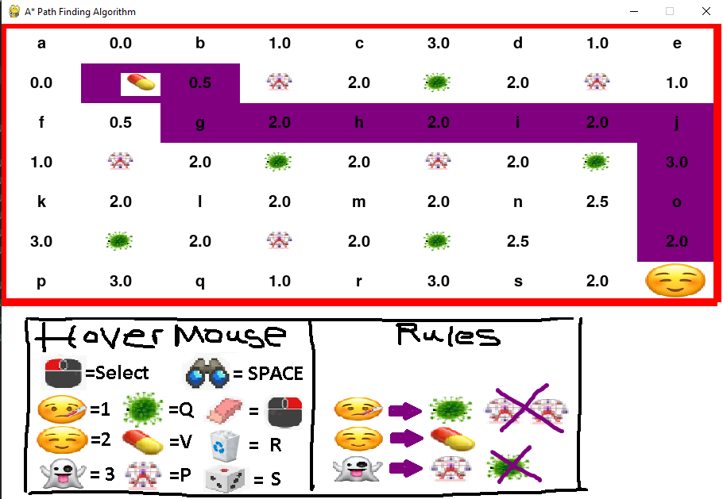
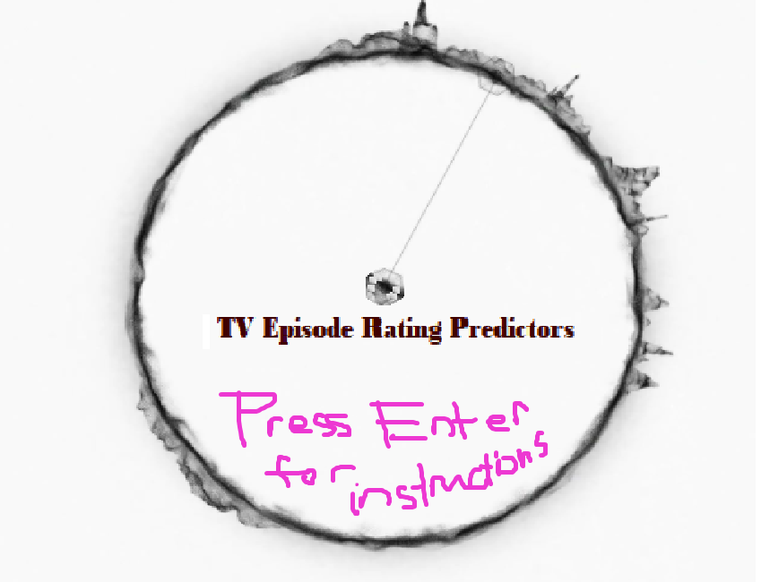

# COMP472

Artificial Intelligence

# Projects

> > # [Pathfinder game](https://github.com/yida-li/COMP472/tree/master/project1)

> > > Algorithm : A\* Search

> > > > > 

> > > > > 

> > # [Machine Learning reviews predictions](https://github.com/yida-li/COMP472/tree/master/project2)

> > > Algorithm : Naive Bayes classifier

> > > > > 

> > > > > 

> > # [Emotion Recognition](https://github.com/yida-li/COMP472/tree/master/project2)

> > > Algorithm : [Haar Cascades Classifier](https://github.com/opencv/opencv/tree/master/data/haarcascades)

> > > Pre-existing testing Dataset using : [CNN modeling](https://github.com/akmadan/Emotion_Detection_CNN/blob/main/emotion-classification-cnn-using-keras.ipynb)

> > > > > 

