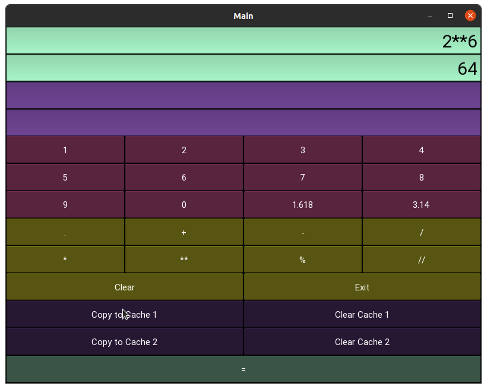
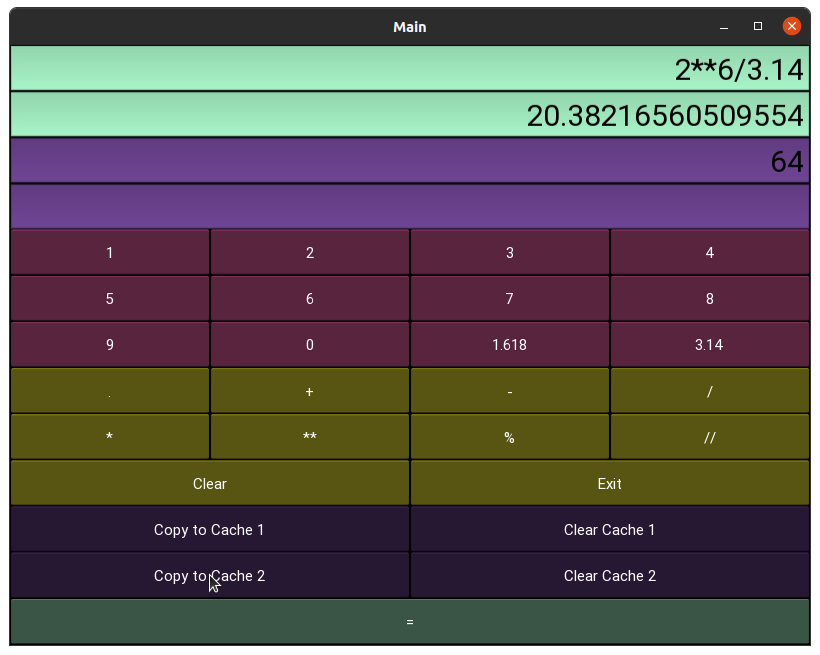
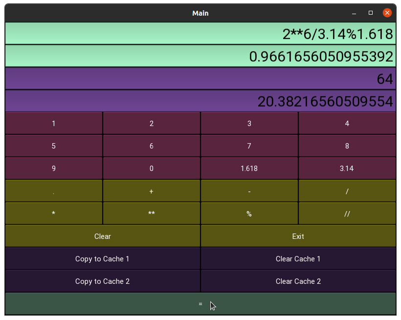
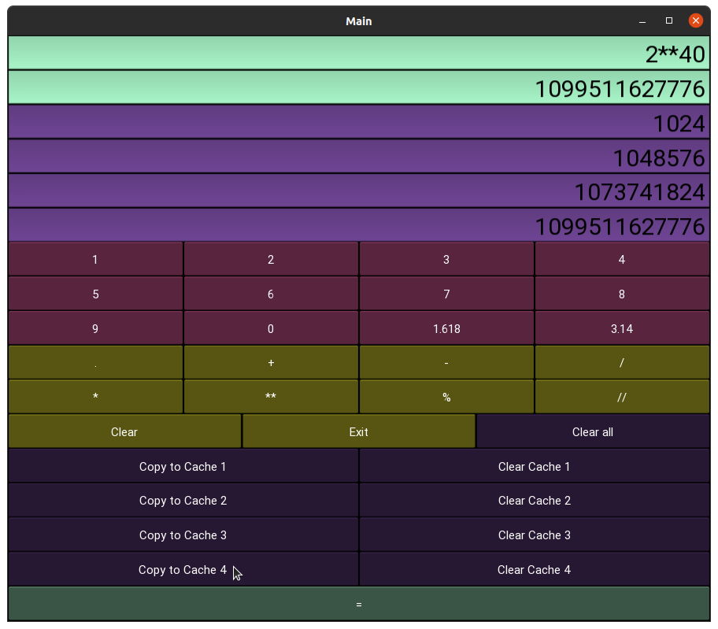

# Python

Searching Algorithms, Network Protocols, Bluetooth, Computer Vision, Machine Learning, GUI , GPS , Application Development 

# Learn

> > # [Practice](https://github.com/yida-li/Python/tree/master/practice/README.md)

> > # [Desktop Automation](https://github.com/yida-li/Python/tree/master/project5)

> > # [Network Protocol](https://github.com/yida-li/Python/tree/master/project6)

# Projects

> > # [Pathfinder game](https://github.com/yida-li/Python/tree/master/project1)

> > > Algorithm : A\* Search

> > > > > 

> > > > > 

> > # [Calculator](https://github.com/yida-li/Python/tree/master/project8)

> > > > > 

> > > > > 

> > > > > 

> > > > > 

> > > > > 

> > # [Machine Learning reviews predictions](https://github.com/yida-li/Python/tree/master/project2)

> > > Algorithm : Naive Bayes classifier

> > > > > 

> > > > > 

> > # [Emotion/Face Recognition](https://github.com/yida-li/Python/tree/master/project3)

> > > Algorithm : [Haar Cascades Classifier](https://github.com/opencv/opencv/tree/master/data/haarcascades)

> > > Pre-existing Training Model : [CNN modeling](https://github.com/akmadan/Emotion_Detection_CNN/blob/main/emotion-classification-cnn-using-keras.ipynb)

> > > Emotions Data Set : [Facial Expressions](https://www.kaggle.com/jonathanoheix/face-expression-recognition-dataset)

> > > Face Date Set : [me](https://github.com/yida-li/Python/blob/master/project3/README.md)

> > > > > 

> > > > > 

> > # [Object Identification](https://github.com/yida-li/Python/tree/master/project4)

> > > Algorithm : [MobileNetV2, ResNet50, InceptionV3 and DenseNet121](https://github.com/OlafenwaMoses/ImageAI)

> > > Framework & pre-trained Models : [ImageAi](https://imageai.readthedocs.io/en/latest/detection/index.html)

> > > Testing Dataset : [phone camera videos]

> > > > > 

> > > > > 

> > > > > 

> > > > > 

> > > > >  [Phase1 analysis](https://github.com/yida-li/Python/tree/master/project5/path1/phase1_data.txt) 

> > > > >  [Phase2 analysis](https://github.com/yida-li/Python/tree/master/project5/path1/phase2_data.txt) 

> > > > >  [Phase3 analysis](https://github.com/yida-li/Python/tree/master/project5/path1/phase3_data.txt) 

> > > > >  [Phase4 analysis](https://github.com/yida-li/Python/tree/master/project5/path1/phase4_data.txt) 

> > > > >  [Phase5 analysis](https://github.com/yida-li/Python/tree/master/project5/path1/phase5_data.txt) 

> > > > >  [Phase6 analysis](https://github.com/yida-li/Python/tree/master/project5/path1/phase6_data.txt) 

> > > > >  [Phase7 analysis](https://github.com/yida-li/Python/tree/master/project5/path1/phase7_data.txt) 

> > > > >  [Phase8 analysis](https://github.com/yida-li/Python/tree/master/project5/path1/phase8_data.txt) 